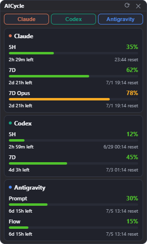
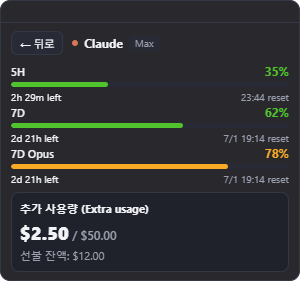

<div align="center">

# AICycle Widget

**An always-on-top desktop widget that shows your AI coding usage for Claude, Codex, and Antigravity — at a glance.**



</div>

---

AICycle Widget is a tiny, compact, always-on-top panel that unifies usage monitoring across **Claude**, **OpenAI Codex**, and **Google Antigravity**. Each provider can be toggled on/off, every window shows how much you've used plus how long until it refreshes, and clicking a card opens a detail view with plan info and extra usage.

Inspired by [OpenTokenMonitor](https://github.com/Hitheshkaranth/OpenTokenMonitor) and [claude-usage-widget](https://github.com/SlavomirDurej/claude-usage-widget), rebuilt from scratch in **Electron** (Node only — no Rust toolchain required).

## Features

- 📊 **Three providers, one widget** — Claude, Codex, Antigravity, each independently toggleable.
- 🟢 **Usage at a glance** — each window (5H / 7D / credits) shows the **used %** with a matching bar.
- ⏱️ **Time-to-refresh first** — how much time is left is shown prominently, with the exact reset clock alongside.
- 🔍 **Detail view** — click any card for plan tier, extra usage / overage ($), credits, and account details.
- 🌐 **Auto language** — UI follows your OS language (English / Korean); compact labels stay short (`5H`, `7D`, `reset`, `left`).
- 🪶 **Compact & always-on-top** — auto-sizes to its content; lives in the corner without taking over your screen.
- ⚙️ **Tray menu** — refresh, always-on-top, launch-at-startup, Claude logout, quit.

## Screenshots

| Compact | Detail |
|---|---|
|  |  |

## How it gets your usage

All data is read locally / from the official services you're already signed into — nothing is sent anywhere.

| Provider | Source | Notes |
|---|---|---|
| **Claude** | `claude.ai` usage API via a one-time in-app login (sessionKey, stored encrypted in the OS keychain) | Shows 5H / 7D / 7D-Opus % + reset and extra usage (overage / prepaid). Not logged in → just a login button. |
| **Codex** | `chatgpt.com/backend-api/codex/usage` using the token in `~/.codex/auth.json` | Fetched through a hidden Chromium window (passes Cloudflare). Shows 5H / weekly % + reset, plan, credits. Falls back to local token counts from `~/.codex/logs_2.sqlite`. |
| **Antigravity** | The Antigravity IDE's local Language Server (loopback, no extra auth) | Live only while the IDE is open; shows prompt/flow credit usage + reset and full plan details. When closed, the last fetched value is cached and shown. |

## Requirements

- **Node.js 18+** (build/dev). The runtime bundles Electron 35 (Node 22) for built-in `node:sqlite`.
- Windows (primary target). The collectors use Windows paths/APIs; macOS/Linux would need adjustments.

## Getting started

```bash
npm install
npm run dev        # launch the widget (development)
npm run build      # production bundle
npm run package    # Windows installer (nsis) via electron-builder
```

On first run, click **"Log in to Claude (once)"** to connect Claude. Codex works automatically if you're signed into the Codex CLI. For Antigravity, keep the IDE open.

## Project structure

```
src/
  main/            Electron main: window, tray, polling, settings, i18n
    collectors/    claude · claude-web · codex · codex-web · antigravity · types
  preload/         contextBridge IPC
  renderer/        React UI (Widget, DetailView, WindowBar, toggles)
  shared/          i18n (shared by main + renderer)
```

## Notes & limitations

- The Claude OAuth usage endpoint (`api.anthropic.com/oauth/usage`) is heavily rate-limited and is **not** used; the widget uses the `claude.ai` web session instead.
- Reading the session straight out of Chrome's encrypted cookie store is intentionally not implemented.
- Antigravity has no live data while its IDE is closed (cached value is shown instead).

## Credits

- [OpenTokenMonitor](https://github.com/Hitheshkaranth/OpenTokenMonitor) — multi-provider monitoring approach
- [claude-usage-widget](https://github.com/SlavomirDurej/claude-usage-widget) — claude.ai session usage approach

## License

MIT
